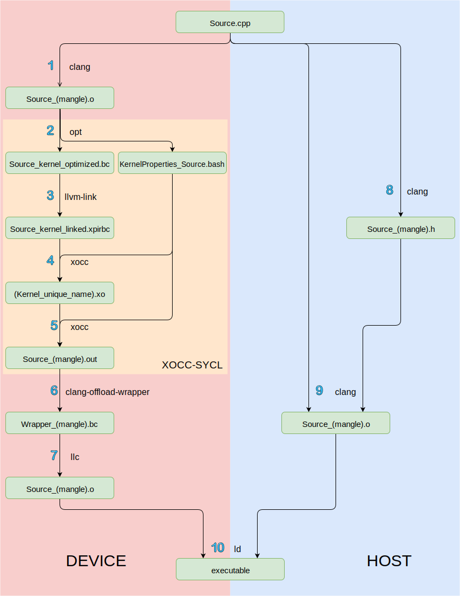

=============================
Architecture of SYCL compiler
=============================

.. section-numbering::

The SYCL compilation workflow is composed by 2 parts, the Host and the Device programs. Despite there is only one source file and one executable, these two compilations are completely different.

Device compilation
==================

The device's kernels compilation workflow is shown on the left-side of `Figure 1`_.
 - 1) During this step ``clang`` will isolate the kernels parts in the source code and compile them in LLVM-IR. The output file is a ``.o`` but in fact LLVM-IR is generated.
 - 2) This step proceeds the SYCL compilation passes.
   The ``InSPIRation`` pass will transform the LLVM-IR in order to use the SPIR library later.
   The ``kernelPropGen`` pass will generate a ``.bash`` file which contains the list of the kernels
   defined in the code. This file will be uses to compile the kernel with ``xocc``.
 - 3) The LLVM linker links the kernel with the ``xocc`` SPIR library.
 - 4) Each kernel of the list contained by the ``KernelProperties_Source.bash`` file is compiled by the ``xocc`` compiler
 - 5) The ``xocc`` linker links all the kernels in an unique file.
 - 6) The ``clang-offload-wrapper`` will create a LLVM-IR file which contains the kernels programs in its data. This will allow the final executable to build the kernel program from this data at runtime.
 - 7) The LLVM compiler will transform the LLVM-IR in a ``.o`` file in order to be linked with the host program to create the final executable.

Host compilation
================

The host program compilation workflow is shown on the right-side of `Figure 1`_.
 - 8) The ``.h`` file produced in this step will contain information about the kernel in order to allow the host program to call them.
 - 9) This compilation will skip all the kernel code to create the host program described by the source, the ``.h`` generated previously allow the program to call the kernels which have been out-lined.

The executable
==============

 The last step (10.) of this workflow is the link of host and device program in an unique executable. This file contains the binary code to execute the host program and to biuld and call the kernel programs. A SYCL compilation takes one source code and produce one executable. This hides to the developer the handling of host and device programs to make the development on hardware accelerator such as FPGAs much easier.
